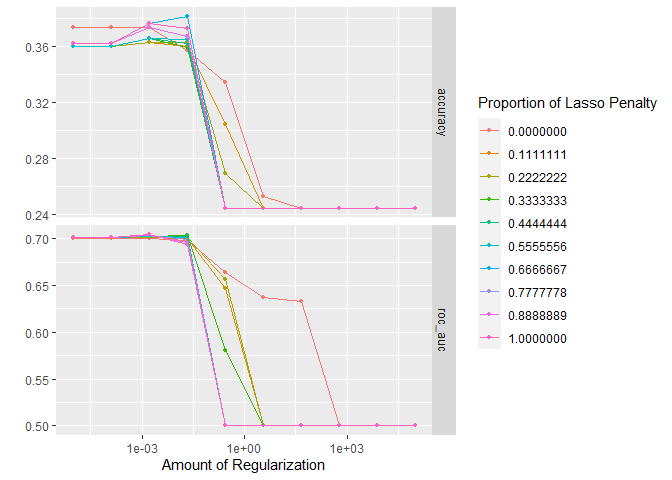

Homework Five: Elastic Net Tuning
================
Carly Greutert

1.  

``` r
library(janitor)
pokemon <- clean_names(pokemon_old)
pokemon
```

    ## # A tibble: 800 x 13
    ##    number name      type_1 type_2 total    hp attack defense sp_atk sp_def speed
    ##     <dbl> <chr>     <chr>  <chr>  <dbl> <dbl>  <dbl>   <dbl>  <dbl>  <dbl> <dbl>
    ##  1      1 Bulbasaur Grass  Poison   318    45     49      49     65     65    45
    ##  2      2 Ivysaur   Grass  Poison   405    60     62      63     80     80    60
    ##  3      3 Venusaur  Grass  Poison   525    80     82      83    100    100    80
    ##  4      3 Venusaur~ Grass  Poison   625    80    100     123    122    120    80
    ##  5      4 Charmand~ Fire   <NA>     309    39     52      43     60     50    65
    ##  6      5 Charmele~ Fire   <NA>     405    58     64      58     80     65    80
    ##  7      6 Charizard Fire   Flying   534    78     84      78    109     85   100
    ##  8      6 Charizar~ Fire   Dragon   634    78    130     111    130     85   100
    ##  9      6 Charizar~ Fire   Flying   634    78    104      78    159    115   100
    ## 10      7 Squirtle  Water  <NA>     314    44     48      65     50     64    43
    ## # ... with 790 more rows, and 2 more variables: generation <dbl>,
    ## #   legendary <lgl>

After cleaning the names of the data set, I noticed that they were all
converted to lower case and all the labels with a period after them
change to an underscore. The function clean_names is useful for creating
unique labels to reference later. It is also useful they are written
similarly.  
2.

``` r
pokemon %>% 
  ggplot(aes(y=type_1)) +
  geom_bar()
```

<!-- -->

``` r
length(unique(pokemon$type_1))
```

    ## [1] 18

``` r
pokemon <- filter(pokemon, type_1=="Bug" | type_1=="Fire" | type_1=="Grass" | type_1=="Normal" | type_1=="Water" | type_1=="Psychic")
names <- c('type_1', 'legendary')
pokemon[,names] <- lapply(pokemon[,names], factor)
pokemon$generation <- as.factor(pokemon$generation)
class(pokemon$generation)
```

    ## [1] "factor"

There are 18 different classes of the outcome. They are all character
classes. 3.

``` r
set.seed(777)
pokemon_split <- initial_split(pokemon, prop = 0.80, strata = 'type_1')
pokemon_train <- training(pokemon_split)
pokemon_test <- testing(pokemon_split)
dim(pokemon_train)
```

    ## [1] 364  13

``` r
dim(pokemon_test)
```

    ## [1] 94 13

``` r
pokemon_folds <- vfold_cv(pokemon_train, v = 5, strata=type_1)
```

It is a good idea to stratify the folds on type_1 so that the class
ratios are more balanced, we do not want to over or under sample.  
4.

``` r
pokemon_recipe <- recipe(type_1 ~ legendary + generation + sp_atk + attack + speed + defense + hp + sp_def, pokemon_train) %>% 
  step_dummy(legendary) %>%
  step_dummy(generation) %>%
  step_normalize(all_predictors())
```

5.  

``` r
elastic_grid <- grid_regular(penalty(range = c(-5,5)), mixture(range = c(0,1)), levels= 10)
elasticnet <- multinom_reg(penalty = tune(), mixture = tune()) %>%
              set_mode("classification") %>%
              set_engine("glmnet")
elastic_wf <- workflow() %>% 
  add_recipe(pokemon_recipe) %>% 
  add_model(elasticnet)
```

Across 5 folds, I will be fitting 5 models to the data.

6.  

``` r
tune_ent <- tune_grid(
  elastic_wf,
  resamples = pokemon_folds, 
  grid = elastic_grid
)
autoplot(tune_ent)
```

<!-- -->
