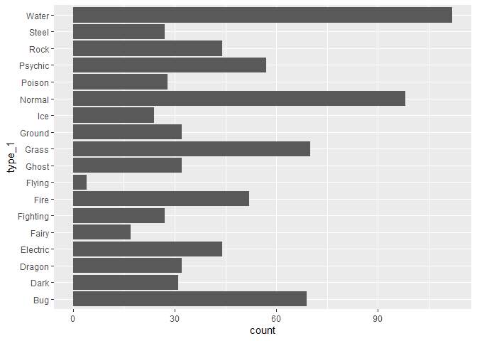
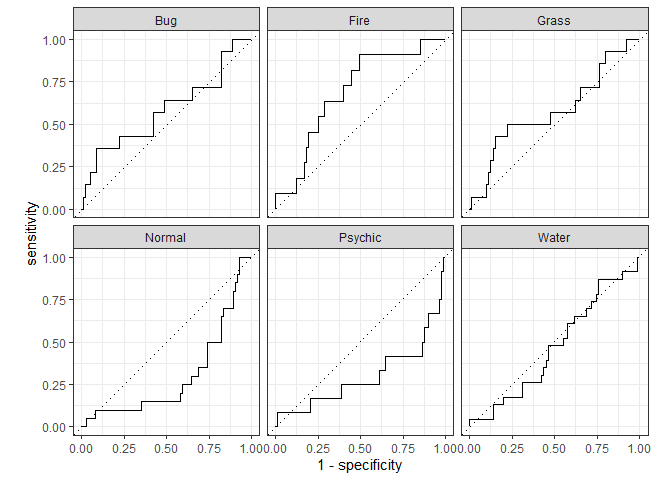
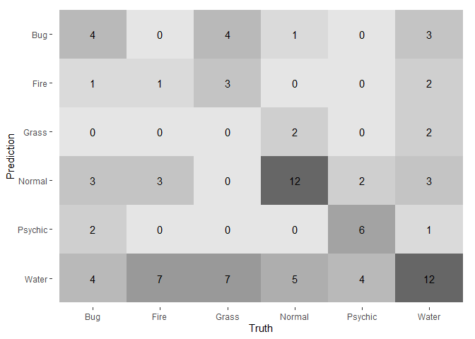

Homework Five: Elastic Net Tuning
================
Carly Greutert

1.  

``` r
library(janitor)
pokemon <- clean_names(pokemon_old)
pokemon
```

    ## # A tibble: 800 x 13
    ##    number name      type_1 type_2 total    hp attack defense sp_atk sp_def speed
    ##     <dbl> <chr>     <chr>  <chr>  <dbl> <dbl>  <dbl>   <dbl>  <dbl>  <dbl> <dbl>
    ##  1      1 Bulbasaur Grass  Poison   318    45     49      49     65     65    45
    ##  2      2 Ivysaur   Grass  Poison   405    60     62      63     80     80    60
    ##  3      3 Venusaur  Grass  Poison   525    80     82      83    100    100    80
    ##  4      3 Venusaur~ Grass  Poison   625    80    100     123    122    120    80
    ##  5      4 Charmand~ Fire   <NA>     309    39     52      43     60     50    65
    ##  6      5 Charmele~ Fire   <NA>     405    58     64      58     80     65    80
    ##  7      6 Charizard Fire   Flying   534    78     84      78    109     85   100
    ##  8      6 Charizar~ Fire   Dragon   634    78    130     111    130     85   100
    ##  9      6 Charizar~ Fire   Flying   634    78    104      78    159    115   100
    ## 10      7 Squirtle  Water  <NA>     314    44     48      65     50     64    43
    ## # ... with 790 more rows, and 2 more variables: generation <dbl>,
    ## #   legendary <lgl>

After cleaning the names of the data set, I noticed that they were all
converted to lower case and all the labels with a period after them
change to an underscore. The function clean_names is useful for creating
unique labels to reference later. It is also useful they are written
similarly.  
2.

``` r
pokemon %>% 
  ggplot(aes(y=type_1)) +
  geom_bar()
```

<!-- -->

``` r
length(unique(pokemon$type_1))
```

    ## [1] 18

``` r
pokemon <- filter(pokemon, type_1=="Bug" | type_1=="Fire" | type_1=="Grass" | type_1=="Normal" | type_1=="Water" | type_1=="Psychic")
names <- c('type_1', 'legendary')
pokemon[,names] <- lapply(pokemon[,names], factor)
pokemon$generation <- as.factor(pokemon$generation)
class(pokemon$generation)
```

    ## [1] "factor"

There are 18 different classes of the outcome. They are all character
classes. 3.

``` r
set.seed(777)
pokemon_split <- initial_split(pokemon, prop = 0.80, strata = 'type_1')
pokemon_train <- training(pokemon_split)
pokemon_test <- testing(pokemon_split)
dim(pokemon_train)
```

    ## [1] 364  13

``` r
dim(pokemon_test)
```

    ## [1] 94 13

``` r
pokemon_folds <- vfold_cv(pokemon_train, v = 5, strata=type_1)
```

It is a good idea to stratify the folds on type_1 so that the class
ratios are more balanced, we do not want to over or under sample.  
4.

``` r
pokemon_recipe <- recipe(type_1 ~ legendary + generation + sp_atk + attack + speed + defense + hp + sp_def, pokemon_train) %>% 
  step_dummy(legendary) %>%
  step_dummy(generation) %>%
  step_normalize(all_predictors())
```

5.  

``` r
elastic_grid <- grid_regular(penalty(range = c(-5,5)), mixture(range = c(0,1)), levels= 10)
elasticnet <- multinom_reg(penalty = tune(), mixture = tune()) %>%
              set_mode("classification") %>%
              set_engine("glmnet")
elastic_wf <- workflow() %>% 
  add_recipe(pokemon_recipe) %>% 
  add_model(elasticnet)
```

Across 5 folds, I will be fitting 5 folds \* 10 penalties \* 10 mixtures
= 500 models to the data.

6.  

``` r
tune_ent <- tune_grid(
  elastic_wf,
  resamples = pokemon_folds, 
  grid = elastic_grid
)
#autoplot(tune_ent)
```

I see that smaller penalty values produce a larger accuracy and ROC AUC.
7.

``` r
best_penalty <- select_best(tune_ent, metric = "roc_auc")
best_penalty
```

    ## # A tibble: 1 x 3
    ##   penalty mixture .config               
    ##     <dbl>   <dbl> <chr>                 
    ## 1 0.00167       1 Preprocessor1_Model093

``` r
ent_final <- finalize_workflow(elastic_wf, best_penalty)
ent_final_fit <- fit(ent_final, data = pokemon_train)
augment(ent_final_fit, new_data = pokemon_test)%>%
  yardstick::accuracy(truth = type_1, estimate = .pred_class)
```

    ## # A tibble: 1 x 3
    ##   .metric  .estimator .estimate
    ##   <chr>    <chr>          <dbl>
    ## 1 accuracy multiclass     0.372

8.  

``` r
augment(ent_final_fit, new_data = pokemon_test) %>%
  roc_auc(type_1, estimate = c(.pred_Bug, .pred_Fire, .pred_Water, .pred_Grass, .pred_Normal, .pred_Psychic))
```

    ## # A tibble: 1 x 3
    ##   .metric .estimator .estimate
    ##   <chr>   <chr>          <dbl>
    ## 1 roc_auc hand_till      0.488

``` r
augment(ent_final_fit, new_data = pokemon_test) %>%
roc_curve(type_1, estimate = c(.pred_Bug, .pred_Fire, .pred_Water, .pred_Grass, .pred_Normal, .pred_Psychic)) %>%
autoplot()
```

<!-- -->

``` r
augment(ent_final_fit, new_data = pokemon_test) %>%
  conf_mat(truth = type_1, estimate = .pred_class) %>% 
  autoplot(type = "heatmap")
```

<!-- -->

I notice that my model is not very good at precting the type of Pokemon.
I also see that the model is best at predicting Normal, Psychic, and
Fire types. It is very bad at predicting water, grass, and bug. I think
this means that Pokemon’s statistics does not determine its primary
type. It may also mean that types such as water, grass, and bug do not
have significant defining features in this data set and are more
scattered.
